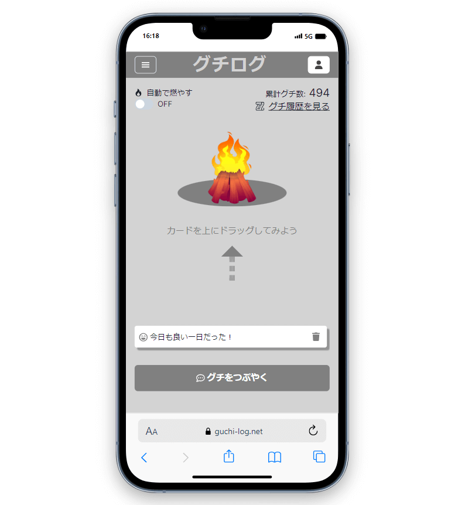
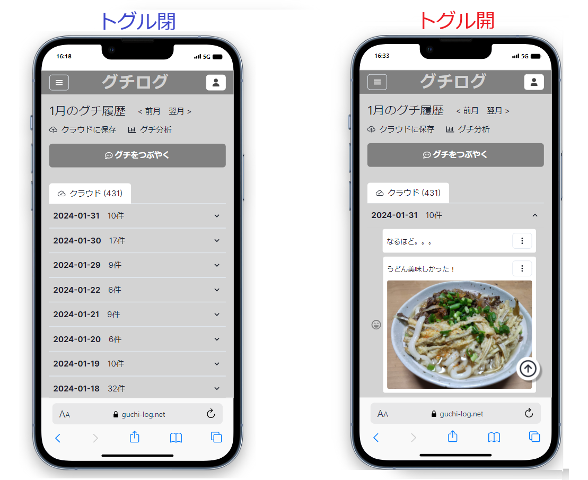
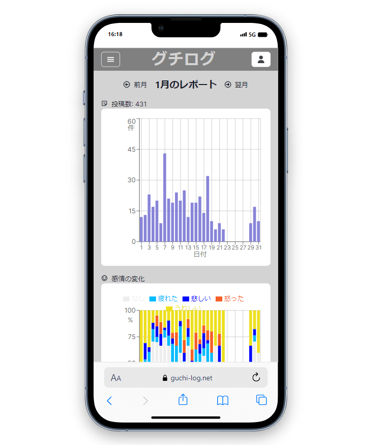
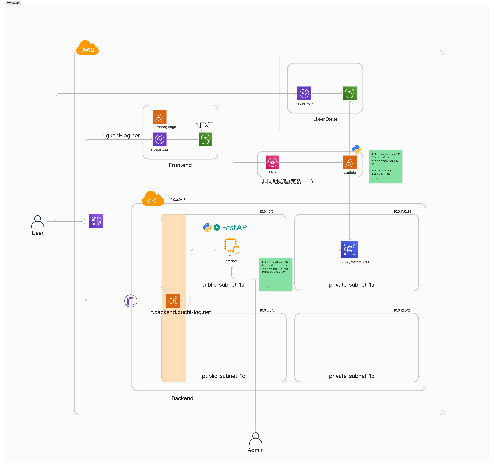

## サービスURL
- TOPページ（閉鎖中）
  - ~~https://guchi-log.net/~~

## サービス概要
- 人目を気にせず愚痴を吐き出せ、日記にすることができるサービス
- 愚痴と一緒に絵文字で感情を記録、振り返りができる

## 解決したい課題

1. 思考整理の場として 
    - 頭の中にあるモヤモヤや本心を安全に書き出したい
    - つぶやきを後で振り返り、自分の思考や感情を客観視したい
2. SNS断ちのツールとして
    - 他人の投稿によって、無意識に自分の思考が影響されることを防ぎたい
    - SNSを見る時間を減らしたい

## 提供機能
### グチのつぶやき
- 非ログイン状態でも、1秒で使い始めることができます
  - 非ログインの場合、ブラウザのIndexedDBにグチを保存します
- ログインするとRDSにグチを保存します

### グチ一覧（日記）
- 選択したグチをSNSに投稿できます
- 日ごとのグチを一覧で確認できます

### グチ分析
- 月間の愚痴の投稿数、感情の変化をグラフで表示します

## 開発中の機能
- グチの感情分析

## 技術スタック
モダンな技術スタックで構成しました！
- Frontend
  - TypeScript, React, Next.js
- Backend
  - Python, FastAPI, GraphQL
- Database
  - PostgreSQL, IndexedDB(フロント)
- Infra
  - AWS, Terraform
- 開発環境
  - Docker, Nginx

## インフラ構成図

### ご注意
- 公開しているコードはβ版のものです。現在のコードとは一致しない場合があります
- セキュリティ等の観点から、一部コードを削除・改変しています
